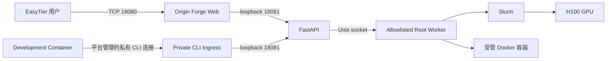

# Origin Forge

**Origin Forge** 是面向单台 NVIDIA H100 服务器的多用户 GPU 计算平台。它把用户入口、
长期开发容器、Slurm 作业、GPU 隔离、配额、审计和受控运维操作整合到一个私有 Portal，
同时保持宿主机与内部控制面不向普通用户开放。

当前生产形态为 **single-node / multi-user / approval-gated multi-GPU and high-memory**，适配
Lenovo SR675 V3、4 × NVIDIA H100 PCIe 80GB 与 Slurm 25.11.7。

## 当前生产版本

| 项目 | 当前值 |
| --- | --- |
| Git | `81baffd2e0d029d00c36072d6c4bb66a37f69e07` |
| Tree | `88d5575ec6672f6611d0b992c914c4210f34e41e` |
| Database | `f5a6b7c8d9e0` |
| Web build | `5zLWuQkUmjlfxeuN88Iop` |
| CLI | `h100 1.0.0` |

该版本已于 2026-09-07 完成生产部署和回归验收。详细证据见
[高内存审批生产部署报告](PORTAL-5A-USER-JOB-MEMORY-APPROVAL-PRODUCTION-DEPLOY-1.md)。

## 生产入口

Portal Web 同时支持两套 EasyTier 地址：

```text
http://10.10.10.220:18080/
http://20.10.10.3:18080/
```

Portal 对用户展示的主访问地址为 `20.10.10.3`。如果浏览器启用了系统代理、Clash 或
V2Ray，请把 `10.10.10.0/24` 和 `20.10.10.0/24` 配置为直连网段。

登录页和 Portal 顶栏提供 `中文 / English` 切换。语言偏好保存在当前访问地址的
`origin_forge_locale` Cookie 中，刷新页面和重新登录后仍然生效；它不包含身份信息，也不
改变 Session、CSRF、API 路径或 EasyTier 入口。

容器 SSH 使用同一个主访问地址和每用户分配的端口，例如：

```bash
ssh -p 22023 origin-pilot@20.10.10.3
ssh -p 22024 origin-pilot2@20.10.10.3
```

## 架构与安全边界



- Web 是唯一浏览器用户入口，只绑定受管 EasyTier 地址的 TCP 18080。
- API 只监听 `127.0.0.1:18081`，不能通过 EasyTier 直接访问。
- 开发容器中的 `h100` CLI 使用平台下发的只读配置连接私有入口；用户不需要配置网关或 API
  地址，私有入口不会暴露管理 API。
- Root Worker 只使用 `/run/h100-portal/worker.sock`，执行固定 handler 与固定 argv，禁止
  任意 root shell。
- 普通用户不能登录宿主机；Linux shell 为 `/usr/sbin/nologin`，密码锁定且没有宿主
  `authorized_keys`。
- 长期开发容器没有 GPU、Docker Socket、MUNGE、特权模式或 host namespace。
- GPU 计算只能通过 Slurm；1 张 GPU 可直接提交，2 至 4 张必须提交完整的模型、框架、
  数据集、并行策略与扩展收益说明并经管理员审批。管理员可降低批准数量，单用户并发占用
  总量仍不超过 4 张，并使用 per-UID systemd device policy 隔离设备。
- Job 内存不超过 32 GiB 时直接提交；更高内存必须提交任务说明、预计内存拆分和必要性说明。
  管理员可以降低批准值但不能超过用户申请，单节点上限为 486377 MiB。
- 每个用户有独立的续期审批策略，续期和回收站恢复都遵循该策略。自动批准仍执行 Lease
  窗口、时长、锁和资源限制，不是绕过审核边界。
- 受控免密 sudo 只能由管理员按用户启用。已有容器仅重建被选中的用户，保留
  `/workspace`、`/home/<user>`、Lease、SSH 和配额；sudo 只取得容器内 root，不提供宿主、
  Docker Socket、MUNGE、Worker Socket 或 GPU 访问。
- PostgreSQL、MariaDB、SlurmDBD、Docker API、MUNGE 与监控内部接口不作为用户入口。

完整设计见 [Portal 架构](portal/docs/architecture.md) 与
[安全模型](portal/docs/security-model.md)。

## 仓库结构

| 路径          | 内容                                                         |
| ------------- | ------------------------------------------------------------ |
| `portal/`     | Next.js Web、FastAPI、Root Worker、数据库迁移和 systemd unit |
| `scripts/`    | 宿主平台安装、用户生命周期、容器和 GPU 隔离工具              |
| `config/`     | Slurm、Pyxis、Enroot、Docker、SSH 与 systemd 的受管配置      |
| `monitoring/` | Prometheus、Grafana、DCGM 与 Node Exporter 配置              |
| `docs/`       | 平台管理员手册、用户指南、硬件和网络运行手册                 |
| `reports/`    | 已脱敏的历史部署与验收结论                                   |
| `tests/`      | GPU device mapping 与隔离验证工具                            |

历史验收编号、`h100-*` 命令、systemd unit 和 Python/TypeScript 包名属于兼容接口，平台
品牌改为 Origin Forge 后仍保留这些技术标识。

## 开发环境

### 依赖

- Python `3.14.x`
- Node.js `24.x`
- pnpm `11.20.0`
- PostgreSQL `18`（完整迁移和生产一致性测试）

安装依赖：

```bash
cd portal
python3.14 -m venv .venv
.venv/bin/pip install --requirement requirements.lock
.venv/bin/pip install --no-deps --no-build-isolation --editable .
corepack enable
pnpm install --frozen-lockfile
```

运行检查：

```bash
cd portal
.venv/bin/ruff check .
.venv/bin/ruff format --check .
.venv/bin/mypy apps/api/src apps/worker/src
.venv/bin/pytest
pnpm lint
pnpm typecheck
pnpm test
pnpm build
```

前端开发服务器固定在 loopback：

```bash
cd portal
pnpm dev
```

浏览器访问 `http://127.0.0.1:18080/`。Web 会把同源 `/api/v1/*` 请求转发到
`127.0.0.1:18081`。API、数据库与测试账号设置见
[配置指南](docs/configuration.md)。脱离 H100 宿主时，Root Worker、Docker、Slurm 与真实
GPU 操作应保持不可用，不要用模拟 root shell 绕过边界。

## 生产部署

生产部署不会自动修改数据库 schema，也不会自动重启服务。标准顺序是：

1. 检查 Git、Slurm 队列、监听端口和当前服务状态。
2. 根据 [配置指南](docs/configuration.md) 准备 root-owned 环境文件。
3. 安装锁定依赖，运行 Python/Web 全套检查并构建 Next.js standalone 输出。
4. 显式运行 Alembic migration，并验证 `current` 与 `check`。
5. 执行正式 runtime 安装器。
6. 只重启实际变更的 Portal 服务，随后运行健康、安全边界与用户入口验收。

核心命令：

```bash
cd /srv/gpu-platform/platform/portal
pnpm install --frozen-lockfile
pnpm lint
pnpm typecheck
pnpm test
pnpm build

sudo /srv/gpu-platform/platform/portal/deploy/scripts/install-runtime.sh
sudo systemd-analyze verify \
  /etc/systemd/system/h100-portal-web.service \
  /etc/systemd/system/h100-portal-api.service \
  /etc/systemd/system/h100-portal-worker.socket \
  /etc/systemd/system/h100-portal-worker.service
```

迁移、服务启用、精确重启、验收和回滚命令见
[Portal 部署手册](portal/docs/deployment.md)。不要把示例命令当作跳过备份、migration 或
生产变更审批的许可。

## 配置原则

- 生产秘密只允许位于 `/etc/h100-portal/portal.env` 等 root-owned 文件，不提交 Git。
- 从 `portal/deploy/portal.env.example` 生成配置，替换所有 `REPLACE_WITH_*` 值。
- `PORTAL_PUBLIC_ACCESS_HOST` 必须是一个具体 IPv4 地址，不能设置为 `0.0.0.0`。
- `PORTAL_ALLOWED_ORIGINS` 必须逐项精确列出，不能设置为 `*`。
- 内网 HTTP 是当前受控虚拟网络部署的已接受模式，不代表允许公网暴露；扩大范围时应优先
  部署 TLS，并设置 Secure Cookie。
- 本地 OCI artifact 是受管容器镜像的 source of truth；部署不得临时开放 registry 或修改
  DNS 绕过网络政策。

## 运维与使用文档

- [配置指南](docs/configuration.md)
- [Portal 部署与回滚](portal/docs/deployment.md)
- [Portal 安全模型](portal/docs/security-model.md)
- [Root Worker API](portal/docs/root-worker-api.md)
- [SSH 与容器访问用户指南](portal/docs/ssh-access-user-guide.md)
- [中文用户手册](docs/PORTAL-5A-H100-GPU-PLATFORM-USER-MANUAL-ZH.md)
- [English User Manual](docs/PORTAL-5A-H100-GPU-PLATFORM-USER-MANUAL-EN.md)
- [发布说明](RELEASE-NOTES-PORTAL-5A-FULL-PLATFORM-RELEASE.md)
- [平台管理员手册](docs/pilot-admin-runbook.md)
- [平台用户指南](docs/pilot-user-guide.md)
- [Mellanox 物理链路手册](docs/mellanox-physical-link-field-runbook.md)

## 当前范围限制

ConnectX-6 Lx P0 的历史物理 CRC/symbol error 尚未物理修复，因此当前不支持 RDMA、RoCE、
multinode、NFS、multinode NCCL 或第二节点扩展。MIG 保持 disabled。
